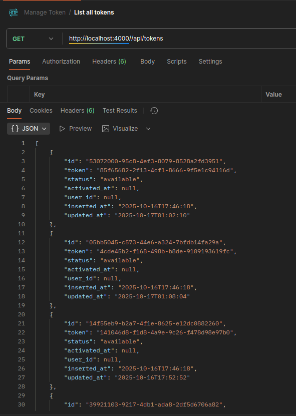
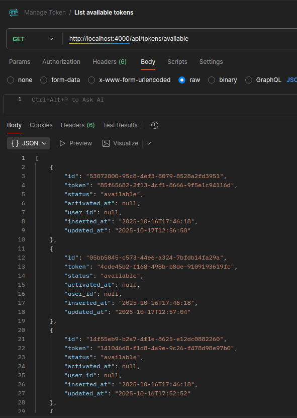
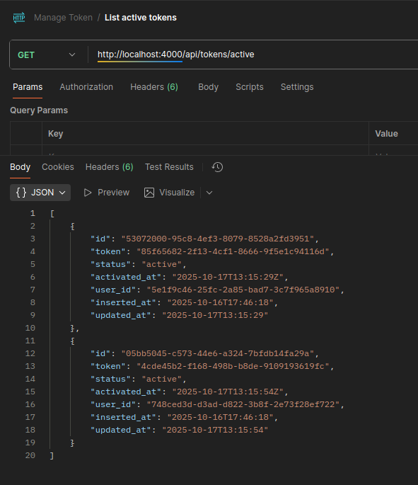
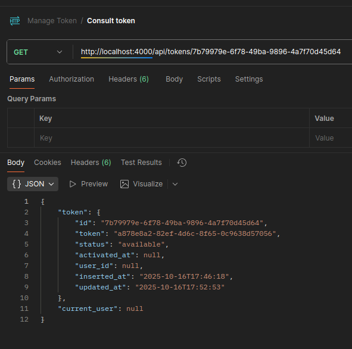
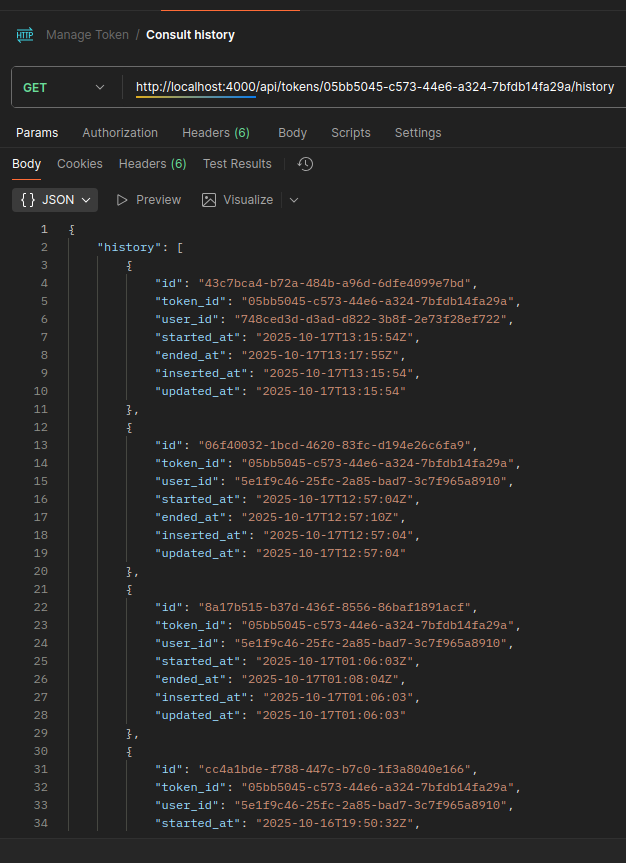
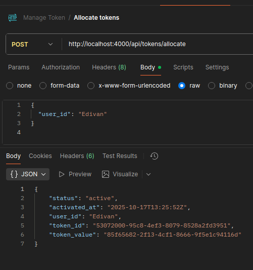
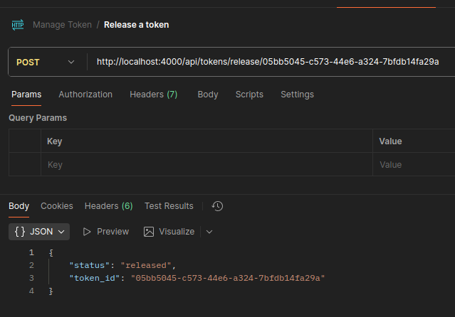
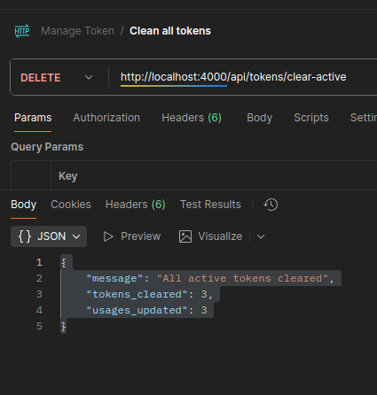

# TokenManager — Desafio Técnico Backend

Sistema de gerenciamento de tokens com alocação controlada, liberação automática e histórico de uso. Desenvolvido em Elixir com Phoenix e PostgreSQL.

---

- [Collection Postman](https://edivan-9314386.postman.co/workspace/Edivan-'s-Workspace~1792ec87-035b-4a1f-8ab9-d452e13b3d74/collection/44130436-0c20ef20-6666-4550-bfc5-d929688013d3?action=share&source=copy-link&creator=44130436)

##  Como Rodar o Projeto

### 1. Clone o repositório:
git clone https://github.com/EdivanTravel/token_manager.git
   

### 2. Instale as dependências:   
mix deps.get

###  3. Suba os containers (PostgreSQL e aplicação
docker-compose up --build (Isso iniciará o banco de dados PostgreSQL e o servidor Phoenix na porta 4000.)

### 4. Configure o banco de dados
mix ecto.create
mix ecto.migrate

### 5. Rode os seeds (dados iniciais)
mix run priv/repo/seeds.exs

### 6. Acesse a aplicação
http://localhost:4000

## Rotas 

|  Método  | Rota                       | Descrição                      |
| :------: | :------------------------- | :----------------------------- |
|   `GET`  | `/api/tokens`              | Lista todos os tokens          |
|   `GET`  | `/api/tokens/available`    | Lista tokens disponíveis       |
|   `GET`  | `/api/tokens/active`       | Lista tokens ativos            |
|   `GET`  | `/api/tokens/:id`          | Mostra detalhes de um token    |
|   `GET`  | `/api/tokens/:id/history`  | Histórico de uso do token      |
|  `POST`  | `/api/tokens/allocate`     | Aloca um token para um usuário |
|  `POST`  | `/api/tokens/release/:id`  | Libera um token específico     |
| `DELETE` | `/api/tokens/clear-active` | Libera todos os tokens ativos  |

## Como usar a API

### - Lista todos os tokens

### - Lista todos os tokens que não estão em uso 

### - Lista todos os tokens em uso

### - Exibe detalhes de um determinado token

### - Exibe o histórico de uso de um determinado token

### - Atribue um token disponível a um usuário

### - Libera um token específico

### - Libera todos os tokens ativos

##  Tecnologias Utilizadas

---
## Tarefas Automáticas

A limpeza de tokens expirados é feita através de jobs do Oban, executados periodicamente a cada 1 minuto.
Tokens ativos há mais de 2 minutos são automaticamente liberados.

## Licença

Este projeto foi desenvolvido como desafio técnico backend.
Licença livre para fins educacionais e de demonstração.

